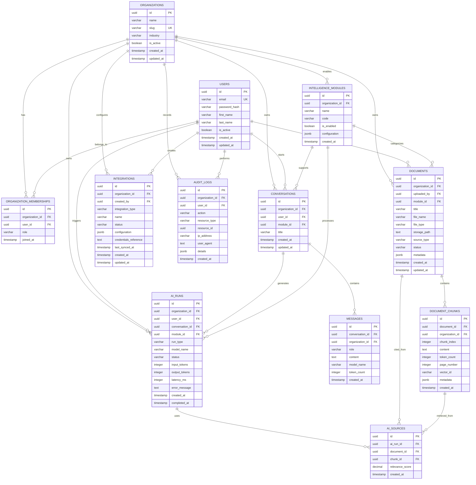

# Enterprise Intelligence Platform Database Design

## 1. Database Overview

The platform uses PostgreSQL as its primary relational database.

The database is designed to support:

- Multiple organizations
- Multiple users per organization
- Role-based access control
- Document and knowledge management
- AI conversations
- RAG document retrieval
- Multiple intelligence domains
- External system integrations
- Audit logging

The platform follows a multi-tenant architecture.

Each organization's data is isolated using an `organization_id`.

---

## 2. Main Entities

### Organizations

Represents companies or institutions using the platform.

| Column | Type | Description |
|---|---|---|
| id | UUID | Primary key |
| name | VARCHAR | Organization name |
| slug | VARCHAR | Unique organization identifier |
| industry | VARCHAR | Legal, finance, healthcare, government, etc. |
| is_active | BOOLEAN | Organization status |
| created_at | TIMESTAMP | Creation date |
| updated_at | TIMESTAMP | Last update date |

---

### Users

Represents platform users.

| Column | Type | Description |
|---|---|---|
| id | UUID | Primary key |
| email | VARCHAR | Unique user email |
| password_hash | VARCHAR | Encrypted password |
| first_name | VARCHAR | User first name |
| last_name | VARCHAR | User last name |
| is_active | BOOLEAN | Account status |
| created_at | TIMESTAMP | Account creation date |
| updated_at | TIMESTAMP | Last update date |

Passwords must never be stored as plain text.

---

### Organization Memberships

Connects users to organizations.

A user may belong to more than one organization.

| Column | Type | Description |
|---|---|---|
| id | UUID | Primary key |
| organization_id | UUID | References organizations |
| user_id | UUID | References users |
| role | VARCHAR | owner, admin, analyst, member, viewer |
| joined_at | TIMESTAMP | Membership creation date |

A unique constraint must exist on:

```text
organization_id + user_id
```

---

### Intelligence Modules

Represents the business domains enabled for an organization.

Examples:

- Legal Intelligence
- Financial Intelligence
- Healthcare Intelligence
- Risk Intelligence
- Market Intelligence

| Column | Type | Description |
|---|---|---|
| id | UUID | Primary key |
| organization_id | UUID | References organizations |
| name | VARCHAR | Module name |
| code | VARCHAR | legal, finance, healthcare, risk |
| is_enabled | BOOLEAN | Module status |
| configuration | JSONB | Module configuration |
| created_at | TIMESTAMP | Creation date |

---

### Documents

Stores metadata about uploaded or connected documents.

The actual file is stored in object storage, not directly inside PostgreSQL.

| Column | Type | Description |
|---|---|---|
| id | UUID | Primary key |
| organization_id | UUID | References organizations |
| uploaded_by | UUID | References users |
| module_id | UUID | Optional intelligence module |
| title | VARCHAR | Document title |
| file_name | VARCHAR | Original file name |
| file_type | VARCHAR | PDF, DOCX, TXT, CSV |
| storage_path | TEXT | File location in object storage |
| source_type | VARCHAR | upload, Google Drive, SharePoint, API |
| status | VARCHAR | uploaded, processing, ready, failed |
| metadata | JSONB | Additional document metadata |
| created_at | TIMESTAMP | Upload date |
| updated_at | TIMESTAMP | Last update date |

---

### Document Chunks

Stores the smaller text sections created from documents for RAG.

| Column | Type | Description |
|---|---|---|
| id | UUID | Primary key |
| document_id | UUID | References documents |
| organization_id | UUID | References organizations |
| chunk_index | INTEGER | Chunk order |
| content | TEXT | Extracted text |
| token_count | INTEGER | Number of tokens |
| page_number | INTEGER | Source page |
| vector_id | VARCHAR | Reference to vector database |
| metadata | JSONB | Additional chunk metadata |
| created_at | TIMESTAMP | Creation date |

The embeddings may be stored in a vector database or using PostgreSQL with pgvector.

---

### Conversations

Represents AI Assistant conversations.

| Column | Type | Description |
|---|---|---|
| id | UUID | Primary key |
| organization_id | UUID | References organizations |
| user_id | UUID | References users |
| module_id | UUID | Optional intelligence module |
| title | VARCHAR | Conversation title |
| created_at | TIMESTAMP | Creation date |
| updated_at | TIMESTAMP | Last message date |

---

### Messages

Stores messages inside conversations.

| Column | Type | Description |
|---|---|---|
| id | UUID | Primary key |
| conversation_id | UUID | References conversations |
| organization_id | UUID | References organizations |
| role | VARCHAR | user, assistant, system |
| content | TEXT | Message content |
| model_name | VARCHAR | AI model used |
| token_count | INTEGER | Tokens consumed |
| created_at | TIMESTAMP | Message creation date |

---

### AI Runs

Stores information about each AI processing operation.

Examples:

- RAG question answering
- Contract analysis
- Risk classification
- Executive summary generation

| Column | Type | Description |
|---|---|---|
| id | UUID | Primary key |
| organization_id | UUID | References organizations |
| user_id | UUID | References users |
| conversation_id | UUID | Optional conversation |
| module_id | UUID | Optional intelligence module |
| run_type | VARCHAR | chat, rag, summary, classification |
| model_name | VARCHAR | AI model used |
| status | VARCHAR | pending, running, completed, failed |
| input_tokens | INTEGER | Input token count |
| output_tokens | INTEGER | Output token count |
| latency_ms | INTEGER | Processing duration |
| error_message | TEXT | Error details |
| created_at | TIMESTAMP | Run start date |
| completed_at | TIMESTAMP | Run completion date |

---

### AI Sources

Stores the document chunks used to generate an AI response.

This allows the platform to display citations.

| Column | Type | Description |
|---|---|---|
| id | UUID | Primary key |
| ai_run_id | UUID | References AI runs |
| document_id | UUID | References documents |
| chunk_id | UUID | References document chunks |
| relevance_score | DECIMAL | Retrieval similarity score |
| created_at | TIMESTAMP | Creation date |

---

### Integrations

Represents external enterprise data sources.

Examples:

- Google Drive
- SharePoint
- Outlook
- SQL databases
- External APIs

| Column | Type | Description |
|---|---|---|
| id | UUID | Primary key |
| organization_id | UUID | References organizations |
| created_by | UUID | References users |
| integration_type | VARCHAR | Google Drive, SharePoint, SQL, API |
| name | VARCHAR | Integration display name |
| status | VARCHAR | active, disconnected, error |
| configuration | JSONB | Non-sensitive settings |
| credentials_reference | TEXT | Secure secrets-manager reference |
| last_synced_at | TIMESTAMP | Last synchronization |
| created_at | TIMESTAMP | Creation date |
| updated_at | TIMESTAMP | Last update date |

Sensitive credentials must not be stored directly inside the database.

---

### Audit Logs

Stores important activities for security and compliance.

| Column | Type | Description |
|---|---|---|
| id | UUID | Primary key |
| organization_id | UUID | References organizations |
| user_id | UUID | References users |
| action | VARCHAR | login, upload_document, delete_document |
| resource_type | VARCHAR | document, user, integration |
| resource_id | UUID | Affected resource |
| ip_address | VARCHAR | User IP address |
| user_agent | TEXT | Client information |
| details | JSONB | Additional event details |
| created_at | TIMESTAMP | Event date |

---

## 3. Entity Relationship Diagram



---

## 4. Multi-Tenant Data Isolation

All organization-specific tables must contain:

```text
organization_id
```

Every database query must filter records using the authenticated user's organization.

Example:

```sql
SELECT *
FROM documents
WHERE organization_id = :current_organization_id;
```

This prevents one organization from accessing another organization's data.

---

## 5. Primary Key Strategy

UUID is used instead of sequential integer IDs.

Example:

```text
550e8400-e29b-41d4-a716-446655440000
```

UUIDs are preferred because they:

- Are difficult to guess
- Work well in distributed systems
- Reduce ID collisions
- Improve security when IDs appear in APIs

---

## 6. Data Storage Strategy

PostgreSQL stores:

- Users
- Organizations
- Permissions
- Document metadata
- Conversations
- AI run history
- Integrations
- Audit logs

Object storage stores:

- PDF files
- Word documents
- Images
- Large uploaded files

Vector storage stores:

- Document embeddings
- Semantic search vectors

Redis stores temporary data such as:

- Cached responses
- User sessions
- Rate-limiting counters
- Background task status

---

## 7. Initial MVP Tables

The first implementation will begin with:

1. organizations
2. users
3. organization_memberships
4. documents
5. document_chunks
6. conversations
7. messages

The remaining tables will be introduced gradually as the platform grows.